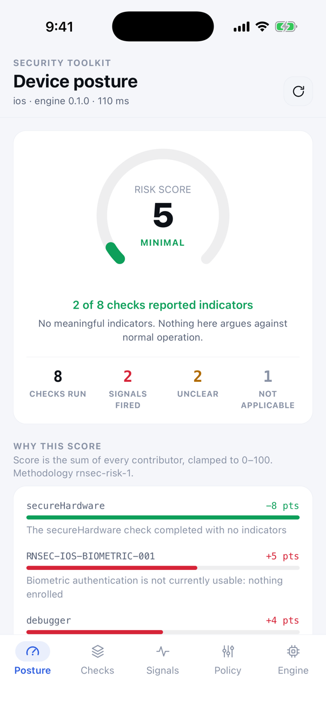
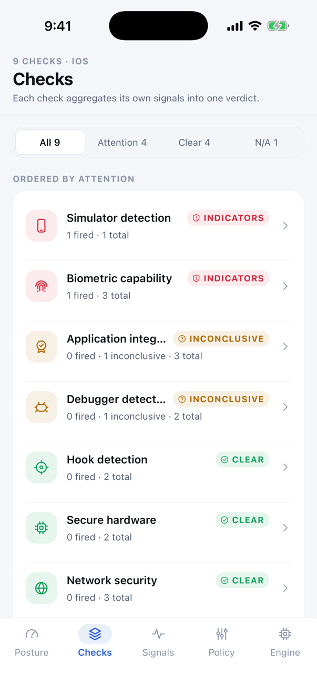
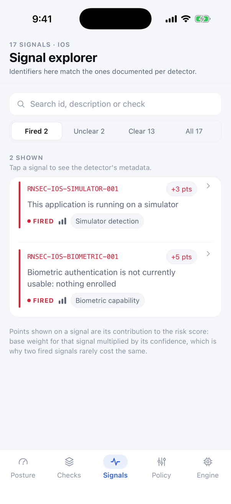
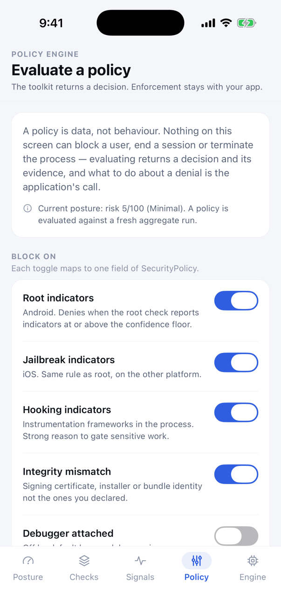
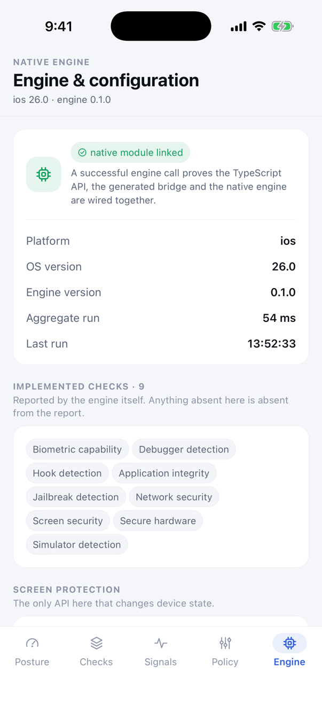

# Security Toolkit — example app

A working security console built on `react-native-security-toolkit`. It runs one aggregate check of
the native engine and presents it five ways, so the package can be evaluated on a real device rather
than read about.

> Runtime security checks are defence-in-depth signals. They should not be treated as a guarantee
> that a device or application cannot be compromised. The app is written to say that everywhere it
> shows a verdict.

## Screens

<p align="center">
  
  
  
  
  
</p>

<p align="center"><sub>Posture · Checks · Signals · Policy · Engine — iOS Simulator</sub></p>

| Screen           | What it demonstrates                                                                                                                                                      |
| ---------------- | ------------------------------------------------------------------------------------------------------------------------------------------------------------------------- |
| **Posture**      | `SecurityToolkit.checkAll()` — risk score as a gauge, every contributor behind that score, and a posture grid of all checks ordered by what needs attention.              |
| **Checks**       | Each check's verdict, filterable by status, with a legend explaining why `unknown`, `unavailable` and `secure` are three different answers.                               |
| **Check detail** | One check in full: signals grouped by outcome, per-signal metadata, risk points contributed, the check's documented limitations, and a re-run through its focused module. |
| **Signals**      | Every signal in the report, searchable by identifier or description. Identifiers match the ones documented per detector in `docs/runtime/`.                               |
| **Policy**       | `SecurityToolkit.evaluate()` — build a policy with switches, see the compiled `SecurityPolicy`, then read the decision and the evidence behind each denial.               |
| **Engine**       | `getEngineInfo()`, the resolved configuration, the screen-protection control (the toolkit's only mutating API), and a development-mode switch that re-scores in place.    |

Two behaviours are worth watching specifically:

- **Development mode** re-scores the existing results with the public `evaluateRisk()` rather than
  re-running the engine. Debugger, emulator and simulator signals stop contributing to the score and
  the findings underneath are unchanged — development mode changes interpretation, not evidence.
- **Re-run** on a check detail screen calls that check's own module (`RootDetection.getStatus()` and
  friends), so both the aggregate and the focused API are exercised by the example.

## Running it

From the workspace root:

```sh
pnpm install
pnpm build           # builds the package the example consumes
```

Then, in one terminal:

```sh
pnpm example:start   # Metro
```

And in another:

```sh
pnpm example:android
# or
pnpm example:ios
```

For iOS, install pods first — and again whenever a native dependency changes:

```sh
cd example/ios && bundle install && bundle exec pod install
```

A JavaScript reload is not enough after adding a native module. If the app shows **"Native engine not
linked"**, rebuild: that screen is reporting a build problem, not a finding about the device.

## Dependencies

The example has three dependencies the published package does not, and deliberately keeps them here:

| Dependency                       | Why                                                                                                                     |
| -------------------------------- | ----------------------------------------------------------------------------------------------------------------------- |
| `react-native-svg`               | The icon set is hand-drawn — half of these concepts have no icon in a generic set, and a wrong icon is worse than none. |
| `react-native-safe-area-context` | Android 15 enforces edge-to-edge, and core React Native cannot report the bottom inset.                                 |
| `lottie-react-native`            | The loading and not-linked states. See `src/animations/README.md`.                                                      |

Navigation is hand-rolled (`src/navigation/`): five flat destinations and one push do not justify
four more native dependencies in a package example.

## Layout

```text
src/
├── theme/          design tokens and the light/dark palettes
├── icons/          hand-drawn SVG icon set
├── components/     cards, pills, gauge, controls, screen scaffold
├── screens/        the six screens above, plus loading and not-linked states
├── security/       the one report every screen reads, plus display copy and derivations
├── navigation/     tab bar and the push transition
└── utils/
```

## Conventions worth preserving

If you change these screens, three rules are load-bearing rather than stylistic:

1. **Never colour `unknown` like `secure`.** The toolkit is careful to distinguish "we looked and
   found nothing" from "we could not look". Flattening that in the UI reintroduces exactly the
   overclaim the API design avoids.
2. **A score never appears without its contributors.** The arithmetic behind the number lives on the
   same screen as the number.
3. **Wording stays in `src/security/catalog.ts`.** "Potential root indicators detected" and "device
   is rooted" are different claims, and only one of them is true. Keeping the phrasing in one file is
   what stops the wrong version from shipping.
